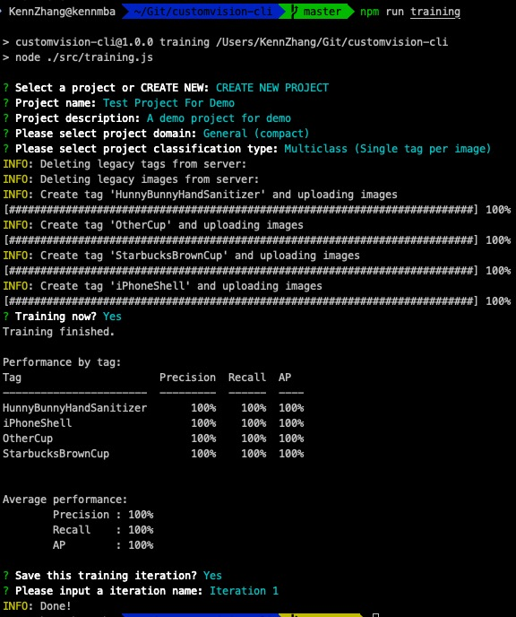
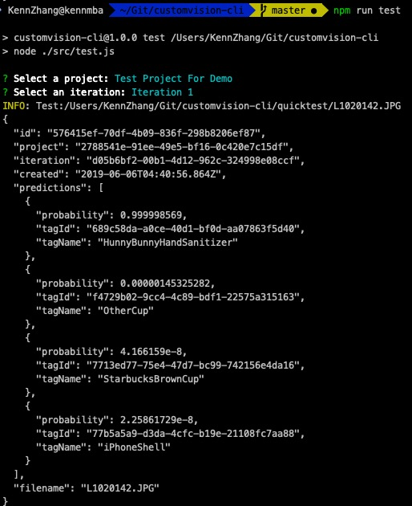
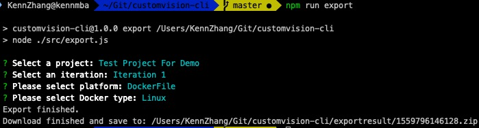

# description

Azure cognitive custom vision tool set. Used to:

1. Training your images
2. Test the training result
3. Export training module.

## How to use

1. clone the code from repo
2. install dependencies

```shell
npm install
```

3. set 'TRAINING_KEY' in .env file or enviroment variable.

### Training

1. Put your image files in 'training' folder, and orgnize with tag as sub-folder name.
2. run the following code:

```shell
npm run training
```



### Test

1. Put your image files need be tested in 'quicktest' folder.
2. Run the following code:

```shell
npm run test
```



### Export

Run the code:

```shell
npm run export
```


